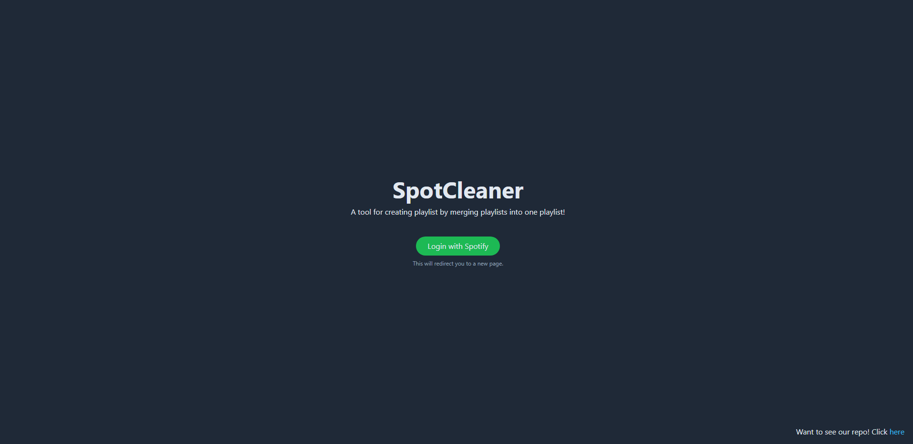
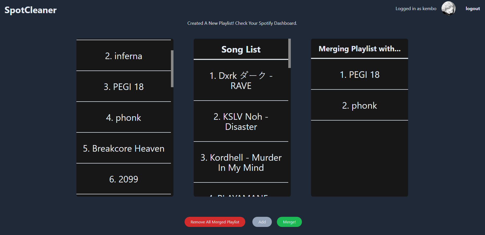
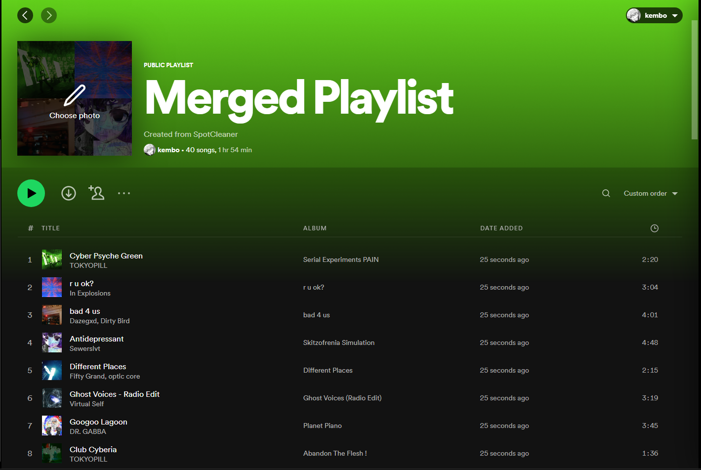

# SpotCleaner - Submission for 2022 BeachHacks 6.0

#### Try it out!: https://spotcleaner.netlify.app/
#### DevPost Link: https://devpost.com/software/spotcleaning

Let's be honest... Spotify's UI is sucks when it comes to effectively editing your playlists. Organizing your music has forever been an infuriating task.Your solution? Tidy up, use SpotCleaner.

### Screenshots: 

## Inspiration

Our team loves to listen to music, but we don't love the atrocity that the 'developers' over at Spotify made. Being able to only add 1 song at a time to a playlist is straight up evil, a thing of the past! What are we doing, LimeWiring songs with dial-up and burning to a CD? Disgusting!

## What it does

SpotCleaner logs you into Spotify, loads your playlists, and gives you the control over your music life that you truly deserve. The ability to add multiple songs and merge playlists together. A truly modern solution for a modern problem.

## How we built it

For our first version, we used Flutter and JS. This version uses React and NodeJS to handle the front-end and back-end.

## Challenges we ran into

Sadly, Flutter and JS don't play nice! Making them work together was the greatest challenge, and it ate a lot of our team leaving us disappointed and unfinished. When switching over to React, we had some issues posting data back to Spotify. Thankfully, after having 60 tabs opens, this problem was resolved. 

## Accomplishments that we're proud of

We love what we made, it's a great tool! Through the JavaScript console, you can do exactly what we wanted, and the UI looks just like we wanted it to -- just without information from the back-end. After rewritting it in JS via React, we are able to create playlist from our app by merging selected playlists!

## What we learned

Committing to a stack for a project without knowing how it will integrate is a dangerous game. Although you may have perks individually for whatever you're developing, it can lead to more headaches and problems if your languages don't easily work together. However, we definitely gained more confidences when working with React and JS. 

## What's next for SpotCleaning

We plan on adding more features to the app as we still like this project idea. But lessons were learned with the stack we chose.

